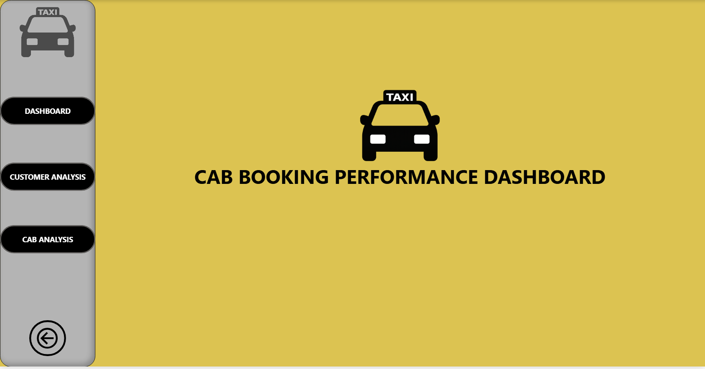
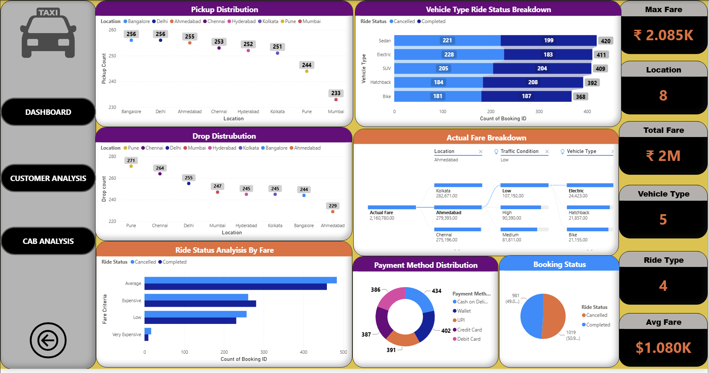
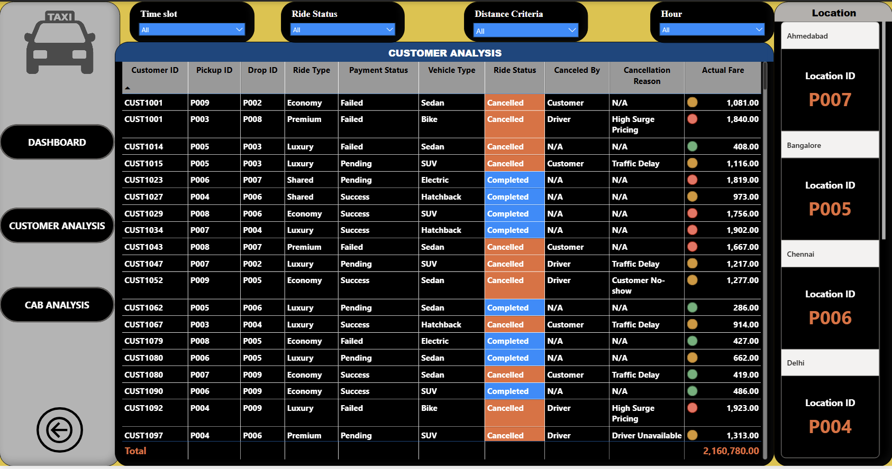
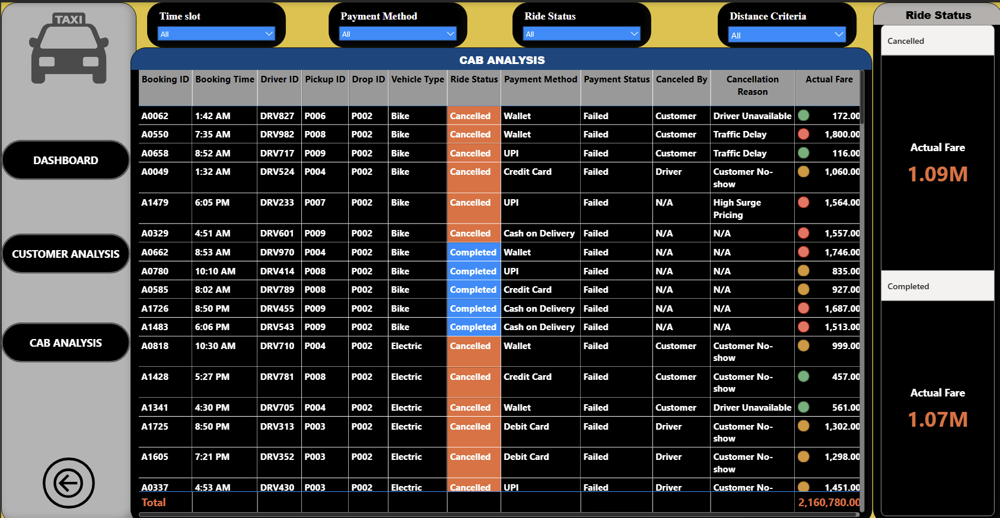
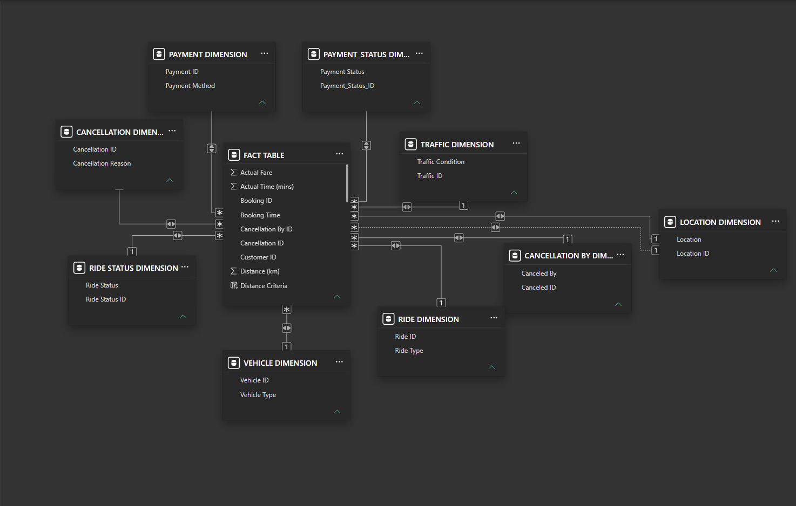

# Cab Booking Performance Analysis Dashboard | Power BI

## Project Overview

This project analyzes cab booking data to uncover key operational and business insights using Microsoft Power BI.

The dashboard provides analysis of:

- Booking and ride status trends (Completed vs Cancelled)
- Pickup and drop location distribution
- Fare and revenue breakdown
- Payment method and payment status insights
- Cancellation reasons and cancelled-by analysis
- Vehicle type performance
- Customer-level and driver-level ride history
- Traffic condition and distance-based fare analysis

The goal of this project is to transform raw cab booking data into meaningful business insights through data modeling, DAX calculations, and interactive visualizations.

---

## Dashboard Preview

### Home


### Dashboard Overview


### Customer Analysis


### Cab Analysis


### Data Model View


---

## Tools & Technologies

- Power BI
- DAX
- Power Query
- Data Modeling
- Excel / CSV Dataset

---

## Data Model

The project follows a **Star Schema** approach, with a central Fact Table connected to multiple dimension tables.

**Fact Table**
- Booking ID, Booking Time
- Customer ID
- Cancellation ID, Cancellation By ID
- Actual Fare
- Actual Time (mins)
- Distance (km), Distance Criteria

**Dimension Tables**
- Location Dimension (Location, Location ID)
- Vehicle Dimension (Vehicle ID, Vehicle Type)
- Ride Dimension (Ride ID, Ride Type)
- Ride Status Dimension (Ride Status, Ride Status ID)
- Payment Dimension (Payment ID, Payment Method)
- Payment Status Dimension (Payment Status, Payment Status ID)
- Cancellation Dimension (Cancellation ID, Cancellation Reason)
- Cancellation By Dimension (Canceled By, Canceled ID)
- Traffic Dimension (Traffic ID, Traffic Condition)

---

## Dashboard Features

### 1. Dashboard Overview
KPIs:
- Max Fare
- Total Fare
- Average Fare
- Total Locations
- Total Vehicle Types
- Total Ride Types

Visuals:
- Pickup distribution by location
- Drop distribution by location
- Vehicle type ride status breakdown (Completed vs Cancelled)
- Actual fare breakdown by location, traffic condition, and vehicle type
- Payment method distribution
- Booking status split (Completed vs Cancelled)
- Ride status analysis by fare category (Low, Average, Expensive, Very Expensive)

### 2. Customer Analysis
Insights, filterable by Time Slot, Ride Status, Distance Criteria, Hour, and Location:
- Customer ID, Pickup ID, Drop ID
- Ride type and vehicle type
- Payment status
- Ride status (Completed / Cancelled)
- Canceled by (Customer / Driver) and cancellation reason
- Actual fare per booking

### 3. Cab Analysis
Insights, filterable by Time Slot, Payment Method, Ride Status, and Distance Criteria:
- Booking ID, Booking Time, Driver ID
- Pickup ID, Drop ID, Vehicle Type
- Ride status and payment status
- Payment method
- Canceled by and cancellation reason
- Actual fare per booking

---

## Key Business Insights

- Identified ride status split between completed and cancelled bookings
- Analyzed cancellation reasons (traffic delay, high surge pricing, customer no-show, driver unavailable) and who cancelled (customer vs driver)
- Compared fare distribution across locations, vehicle types, and traffic conditions
- Evaluated payment method preferences (Cash on Delivery, Wallet, UPI, Credit Card, Debit Card)
- Reviewed pickup and drop location demand across cities
- Improved operational decision-making through visualization

---

## ⚙️ Requirements

To open and explore this project, you need the following tools:

| Tool | Purpose |
|------|---------|
| Microsoft Power BI Desktop | Open, view, and interact with the dashboard |
| Power Query (included in Power BI) | Data cleaning and transformation |
| DAX Engine (included in Power BI) | Execute calculated measures |
| Excel / CSV Reader | View and edit source datasets (optional) |

---

## ▶️ How to Run the Project

### Step 1: Install Power BI Desktop
Download and install Microsoft Power BI Desktop.
Official download: https://powerbi.microsoft.com/desktop/

### Step 2: Clone the Repository
```bash
git clone https://github.com/<your-username>/cab-booking-performance-analysis-power-bi.git
```
Or download the repository as a ZIP file and extract it.

### Step 3: Open the Power BI File
Open `Cab Booking Performance Dashboard.pbix` using Power BI Desktop.

### Step 4: Update Data Source Paths (if required)
If Power BI cannot locate the dataset:
1. Open Power BI Desktop
2. Go to **Home → Transform Data → Data Source Settings**
3. Select the dataset location
4. Update the file path
5. Click **Apply Changes**

### Step 5: Refresh the Data
After connecting the dataset:
**Home → Refresh**

Power BI will load the latest data and update all visuals.

---

## 📂 Project Structure

```
cab-booking-performance-analysis-power-bi/
│
├── Cab Booking Performance Dashboard.pbix
├── Cab_Booking_Data (fact&dimension).xlsx
├── Home.png
├── Dashboard.png
├── Customer_Analysis.png
├── Cab_Analysis.png
├── Data_Model.png
└── Readme.md
```

---

## 🔧 System Requirements

**Recommended:**
- Windows 10/11
- Microsoft Power BI Desktop (latest version)
- Minimum 4GB RAM (8GB+ recommended)
- Internet connection (for downloading Power BI Desktop)

> **Note:** Power BI Desktop is currently available for Windows only. Mac users can view reports through Power BI Service or use a Windows virtual machine.

---

## ✅ Expected Output

After opening the `Cab Booking Performance Dashboard.pbix` file, you will be able to:

- View interactive dashboards
- Apply filters and slicers (Time Slot, Ride Status, Payment Method, Distance Criteria, Location)
- Analyze booking and cancellation trends
- Explore fare, payment, and vehicle-type performance
- Review calculated KPIs and insights
